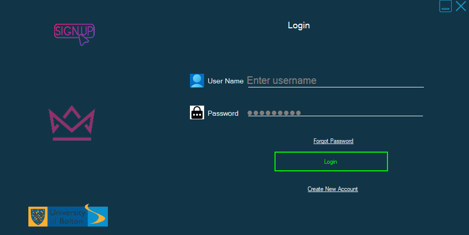

# CTF3204: Fundamentals of Programming  
**Coursework Portfolio – Login Form and Selections (Tasks 1–4)**  
**Module Code:** CTF3204 | **Module Name:** Fundamentals of Programming  

---

## 🖥️ Project Overview
This repository contains a **Windows Forms application** developed in **C#** as part of the coursework portfolio for CTF3204. The project demonstrates key programming concepts, including:  

- Form design and layout using WinForms  
- Input validation and error handling  
- Event-driven programming logic  
- Navigation between multiple user-controlled forms  
- Clean and responsive UI design  

---

## 📌 Objectives

| Task | Description |
|------|-------------|
| **Login System** | Implement credential validation for secure access |
| **Form Navigation** | Enable seamless transitions between multiple forms |
| **Error Handling** | Display informative messages for invalid login attempts |
| **UI Design** | Apply clean and user-friendly interface principles |
| **Academic Presentation** | Organize code and documentation to meet academic standards |

---

## 📁 File Breakdown

| File Name | Description |
|-----------|-------------|
| `Form1.cs` | Handles login logic and input validation |
| `Form2.cs` | Displays post-login content |
| `Program.cs` | Application entry point |
| `Form1.Designer.cs` | UI layout for Form1 |
| `Form2.Designer.cs` | UI layout for Form2 |
| `Form1.resx`, `Form2.resx` | Resource files for forms |
| `WindowsFormsApp1.csproj` | Project configuration and metadata |

---

## ▶️ How to Run

1. **Open the Solution**  
   Open `WindowsFormsApp1.sln` in **Visual Studio**.  

2. **Build and Run**  
   Build and run the project (`WindowsFormsApp1.csproj`).  

3. **Test Login Functionality**  
   Enter valid or invalid user credentials to test login logic.  

> **Note:** The compiled executable (`.exe`) is located in `/bin/Debug/`. Ensure your system has the correct version of the .NET Framework installed.  

---

## 🧪 Testing Summary

| Test Case | Result |
|-----------|--------|
| Valid Credentials | Successfully loads the second form |
| Invalid Credentials | Triggers appropriate error messages |
| Form Transitions | Smooth and responsive navigation |
| Runtime Stability | Application remains stable throughout execution |

---

## 🧠 Reflection

This project strengthened core **C# programming skills**, including:  

- Designing **responsive and user-friendly interfaces**  
- Managing **event-driven form transitions**  
- Writing **maintainable and readable code**  
- Presenting academic work professionally on GitHub  

---

## ⚡ Technologies Used

- **Language:** C#  
- **Framework:** .NET (Windows Forms)  
- **IDE:** Visual Studio  

---

## 📂 Repository Structure
WindowsFormsApp1/ 
├── Form1.cs 
├── Form2.cs 
├── Program.cs 
├── Form1.Designer.cs 
├── Form2.Designer.cs 
├── Form1.resx 
├── Form2.resx 
├── WindowsFormsApp1.csproj 
└── README.md

